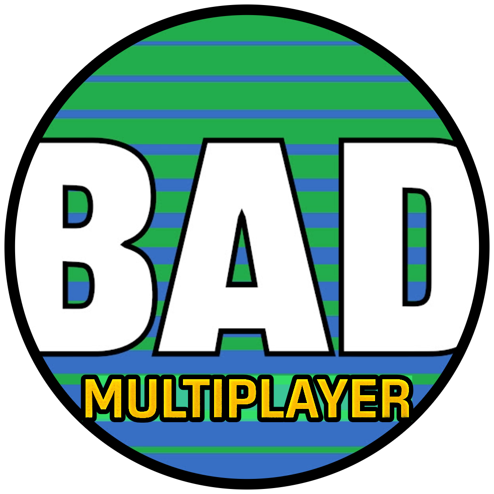

### Godot Intro to Multiplayer
This is the companion project for the [Intro to Godot Multiplayer Course](https://youtu.be/tWLZNCJISYU).

## Usage
- The latest commit represents the finished example project.
- If you want to work from the **starting point**, checkout the commit tagged with "starting point". Then create a new branch and add your changes there.
- Each course section has a corresponding **Tag**. The commit comments are not accurate, please use the tags.
- [Tags](https://github.com/BatteryAcid/godot-intro-multiplayer-1/tags)

## Godot version
- Was built with 4.4, but upgraded to 4.5. 
